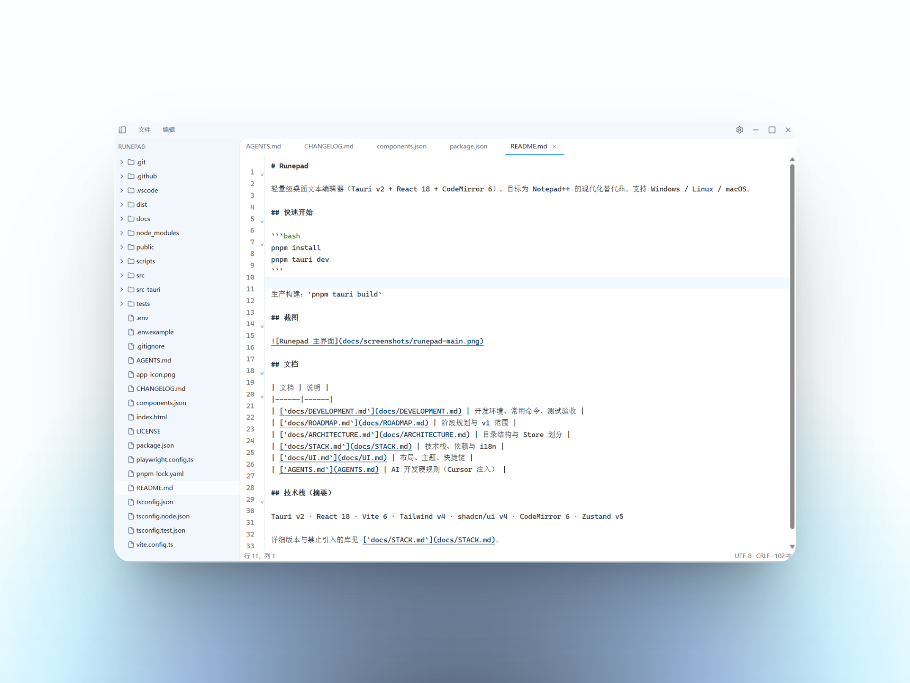

# Runepad

轻量级桌面文本编辑器（Tauri v2 + React 18 + CodeMirror 6），目标为 Notepad++ 的现代化替代品。支持 Windows / Linux / macOS。

## 快速开始

```bash
pnpm install
pnpm tauri dev
```

生产构建：`pnpm tauri build`

## 截图



## 相比 Windows 记事本的优势

| 特性 | 原生记事本 | Runepad |
|------|-----------|---------|
| 多标签页 | ❌ 单窗口单文件 | ✅ 单窗口多标签，中键关闭、拖拽排序 |
| 文件树 / 目录浏览 | ❌ 无 | ✅ 侧边栏文件树，支持目录监听 |
| 语法高亮 | ❌ 无 | ✅ 按扩展名自动高亮（JS/JSON/Markdown 等） |
| 查找 / 替换 | 基础对话框 | ✅ 独立查找替换面板，支持快捷键 `Ctrl+F/R` |
| 最近文件 | ❌ 无 | ✅ 最近打开文件列表 |
| 会话恢复 | ❌ 关闭即丢失 | ✅ 自动恢复标签与侧边栏状态 |
| GBK 等编码读写 | 打开时易乱码 | ✅ 自动检测并正确读写 GBK/UTF-8 等 |
| 跨平台 | 仅 Windows | ✅ Windows / Linux / macOS |
| 现代 UI | 传统界面 | ✅ 自定义标题栏、Light/Dark/System 主题 |
| 状态栏信息 | 行列/缩放 | ✅ 行列、编码、换行符、字数 |
| 右键菜单集成 | 基础 | ✅ 安装后支持「Open with Runepad」 |
| 未保存提示 | 有 | ✅ 关标签时确认，避免误关 |

## 文档

| 文档 | 说明 |
|------|------|
| [`docs/DEVELOPMENT.md`](docs/DEVELOPMENT.md) | 开发环境、常用命令、测试验收 |
| [`docs/ROADMAP.md`](docs/ROADMAP.md) | 阶段规划与 v1 范围 |
| [`docs/ARCHITECTURE.md`](docs/ARCHITECTURE.md) | 目录结构与 Store 划分 |
| [`docs/STACK.md`](docs/STACK.md) | 技术栈、依赖与 i18n |
| [`docs/UI.md`](docs/UI.md) | 布局、主题、快捷键 |
| [`AGENTS.md`](AGENTS.md) | AI 开发硬规则（Cursor 注入） |

## 技术栈（摘要）

Tauri v2 · React 18 · Vite 6 · Tailwind v4 · shadcn/ui v4 · CodeMirror 6 · Zustand v5

详细版本与禁止引入的库见 [`docs/STACK.md`](docs/STACK.md)。
